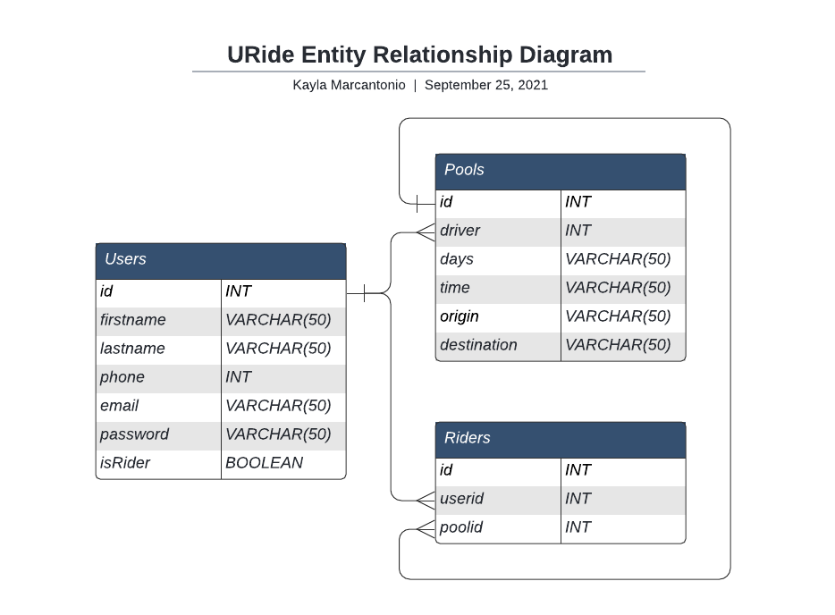

# URide 🚗

URide is a carpooling app for College students to get to and from campus.
Focused on scheduling it matches you to students nearby with similar schedules to alleviate campus parking and emissions.

A ShellHacks 2021 project by **Kayla Marcantonio**, **Nathan Lim**, **Nicholas Yardich**
## Authors

- **Kayla Marcantonio**
- **Nathan Lim**
- **Nicholas Yardich**
# Built With
- Google Cloud SQL (MySQL)
- Google Cloud App Engine
- React

# Documentation
